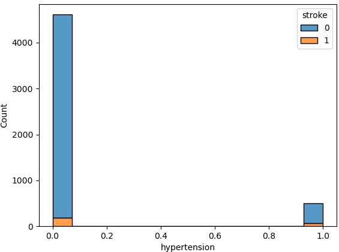
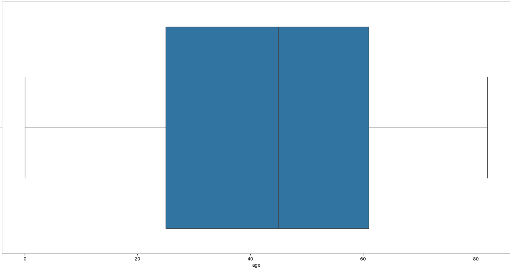

-----------------------------------------------------------------
# Data ScienceTech Institute (DSTI)
> ## S21: Applied MSc in Data Science & Artificial Intelligence
> ### **Python Lab Project: Stroke Prediction Model**
> #### Instructor: Hanna Abi Akl
> #### Student: Constant Patrice A. Kodja Adjovi
> ##### Period: March - April 2024

> Work sharing: [My Stroke Predict Analyses & Models](https://mybinder.org/v2/gh/pkodja/StrokePredict.git/main?labpath=Models%2Fstrokepred.ipynb)
> 
> Github: https://github.com/pkodja/StrokePredict/tree/main
> 
> Coding environment: **CONDA VIRTUAL ENVIRONMENT**
------------------------------------------------------------------

# Stroke Prediction Dataset

## About Dataset

(Confidential Source) - Use only for educational purposes

Size: contains 5110 observations (rows) and 11 clinical features for predicting stroke events

File type: healthcare-dataset-stroke-data.csv

Author: [fedesoriano](https://www.kaggle.com/fedesoriano)

[source link](https://www.kaggle.com/datasets/fedesoriano/stroke-prediction-dataset)

License: Data files © Original Authors

## Context

According to the World Health Organization (WHO) stroke is the 2nd leading cause of death globally, 
responsible for approximately 11% of total deaths.
This dataset is used to predict whether a patient is likely to get stroke based on the input parameters like 
gender, age, various diseases, and smoking status. Each row in the data provides relevant information about the patient.

## Attribute Information

1) **id**: unique identifier
2) **gender**: "Male", "Female" or "Other"
3) **age**: age of the patient
4) **hypertension**: 0 if the patient doesn't have hypertension, 1 if the patient has hypertension
5) **heart_disease**: 0 if the patient doesn't have any heart diseases, 1 if the patient has a heart disease
6) **ever_married**: "No" or "Yes"
7) **work_type**: "children", "Govt_jov", "Never_worked", "Private" or "Self-employed"
8) **Residence_type**: "Rural" or "Urban"
9) **avg_glucose_level**: average glucose level in blood
10) **bmi**: body mass index
11) **smoking_status**: "formerly smoked", "never smoked", "smokes" or "Unknown"*
12) **stroke**: 1 if the patient had a stroke or 0 if not

*Note: "**Unknown**" in smoking_status means that the information is unavailable for this patient

---------------------------------------------------------------------------

# The Academic Project Study

## Objective
  The objective of this academic project is to use data scientist techniques to preprocess and analyze 
  the data structure to discover relevant features to use as inputs for the machine learning process 
  to ultimately select an adequate model for the predictions of stroke events.
  
## Introduction
  In order to achieve the defined objective, this study will go through four main processes before concluding:
  1. Data exploration and analysis
  2. Feature Engineering and Feature Selection
  3. Model Training
  4. Model Evaluation

  The column **stroke** is the target feature or variable and the rest of columns are **explanatory variables or features**.
  
  
## Data Exploration Analysis
  The structure of the dataset will be analyzed to prepare clean and complete data for the following feature analysis.
  
### Data Preprocessing
  As said above, there are 12 features with one target feature or response variable -stroke- and 11 explanatory variables.
  The dataset have:
  * 4 numerical variables: **"id"**, **"age"**, **"avg_glucose_leve"** and **"bmi"**
  * 8 categorical variables with 3 ordinal variables and 5 nominal variables:
    - Ordinal variables: **"hypertension"**, **"heart_disease"** and **"stroke"** (Target Feature)
    - Nominal variables: **"gender"**, **"ever_married"**, **"work_type"**, **"Residence_type"** and **"smoking_status"**

   By observing the dataset **"stroke"** column structure, it looks strongly unbalanced:
  ```
  stroke
  0    4861
  1     249
  Name: count, dtype: int64
  ```
  
  
  There are more unstroked people than stroked ones. The 5110 observations are not much enough to have a balanced dataset
  
  The column **"id"** will be used as the dataset row indexes and not as a pure explanatory variable.
  It remains then 10 variables for data analysis.
  
  The dataset has a single row with **"gender"** column label **"Other"**. 
  This line will be deleted as it could not have a significant impact on the entire dataset.
  The **dataset size** will then be **5109**

  The column **"bmi"** has missing data for 201 observations:
  ```
  df_PrePro.isna().sum()
  
gender                 0
age                    0
hypertension           0
heart_disease          0
ever_married           0
work_type              0
Residence_type         0
avg_glucose_level      0
bmi                  201
smoking_status         0
stroke                 0
dtype: int64
```
Among the 201 observations, there are **40 strokes**, so these observations cannot be removed because of the small number of people who suffered a stroke in the entire dataset.
Their **""bmi"** will be imputed with the dataset stroked observations bmi mean and the rest 161 will have their bmi imputed with the dataset unstroked people bmi mean.

### Categorical Features Analysis
All the categorical features are unbalanced data exactly like for **"stroke"** above.
There more unstroked people than stroked per lable and will lead model to predict within unstroked observations:

Ordinal feature example:

  

Nominal feature example:

  
  
### Numerical Features Analysis
Apart from the feature **"age"** which is a balanced one all the remaining numerical features are imbalance.
Here are some of their characteristics:

* **Age**:
 
  
* **avg_glucose_level**: have outliers and a second mode in outliers above the maximum limit of glucose level average **125**.
  This could be due to the small size of the dataset and will have negative impact on predictions.
  The model is likely to predict within unstroked observations
 
  
* **bmi**: Have many outliers too
  This could be due to the small size of the dataset and will have negative impact on predictions.
  Here too, he model is likely to predict within unstroked observations
 

### Features Comparing Analysis
* Hypertension, avg_glucose_level, ever_married and stroke
Married people with high average glucose level than normal have high stroke rate. The risk seems less for the same people with hypertension

* Hypertension, avg_glucose_level, heart_disease and stroke
  
  As we discussed earlier, people with average glucose levels between 70 and 125 have a high rate of stroke,
  regardless of heart disease or hypertension. Within them, those with hypertension also a bit more chance to face stroke.

* Hypertension, age, avg_glucose_level and stroke
  
  Most people seem to have an average blood sugar below 125, regardless of age, but strokes occur among them in people over 50 years old.
  The data imbalance does not allow to really notice the hypertension impact on those people but we have the same trend for old people with hypertension.

## Feature Engineering and Selection
The nominal categorical features were normalized in ordinal to allow correlations study.

### Target and Explanatory features correlation study:
Pandas function **corr()** uses Pearson process which requires numerical variables.
As nominal categorical variables were normalized in ordinal pd.corr() is used to an overview on the relationship between all the features.


Then adequate statistic tests were used to qualify features relationship as it follows:

* Correlation between numerical variable with Pearson statistic test with **pd.corr()**
  
* Correlation between categorical variables with **Chi2 statistic test** with **chi2_contingency() function**:
  ```
  chi2CorrTest(df_transf["hypertension"],df_transf["stroke"])

  Chi2 Test P_value: 1.688936253410575e-19
  1
  These features are ' correlated' as ''P_value'' < 0.05
  ```
* Correlation between numerical and categorical variables with **ANOVA test** through **"SelectKBest" class**:
  ```
  #import statsmodels.api
  resulta=statsmodels.formula.api.ols('age~work_type',data=df_transf).fit()  
  corrAgeWorkType=statsmodels.api.stats.anova_lm(resulta)
  corrAgeWorkType

  	        df	    sum_sq	       mean_sq	    F	         PR(>F)
  work_type	4.0   	1.215328e+06	303831.964265	1110.246464	0.0
  Residual	5104.0	1.396769e+06	273.661727	  NaN	        NaN


  #import statsmodels.api
  resulta=statsmodels.formula.api.ols('age~ever_married',data=df_transf).fit() 
  corrAgeWorkType=statsmodels.api.stats.anova_lm(resulta)
  corrAgeWorkType

                df	    sum_sq	      mean_sq	      F	          PR(>F)
  ever_married	1.0	    1.204583e+06	1.204583e+06	4370.69022	0.0
  Residual	    5107.0	1.407514e+06	2.756048e+02	NaN	        NaN

  ```

**Feature Engineering conclusion:**
above P-values (0.0 < 0.05) confirm correlations between "age" and "ever_married" and "work_type"; but as pd.corr() 
has previously proved the correlation coefficient of "age" and "ever_married" is high, implying a strong relationship between both. 
So to avoid data redundancy a choice might be made between "age" and "ever_married".

Finally we noticed that only 4 explanatory features -**age, hypertension, heart_disease, avg_glucose_level**- 
have significant correlation with the target feature **"stroke"**.


#### Final features selection:

For this study 2 models will be tested fondamentally based on the use of pd.corr() and SelectKBest():
- Model1: Stroke~age,hypertension,heart_disease,avg_glucose_level (By prefering **age** and leaving out **ever_married** strongly correlated)
- Model2 Stroke~age,hypertension,heart_disease,avg_glucose_level,ever_married  (adding **ever_married** to **Model1**)

The best will be kept.

## Model Training

### Retained features and models:
Model1: Stroke ~ age,hypertension,heart_disease,avg_glucose_level
Model2 Stroke ~ age,hypertension,heart_disease,avg_glucose_level,ever_married

Python classifier models **LogisticRegression, MLPClassifier, DecisionTreeClassifier and RandomForestClassifier** were used
for the data training and prediction.

For the process, the stroke dataset was splitted in training and testing datasets in 80/20 rate.
Each part has its target feature -stroke- and explanatory features.
The testing dataset is used for the prediction and the mode evaluation.

The main process was first managed with the LogisticRegression Classifier model to refine the training and testing datasets.
Logistic regression class_weight='balanced' was used at first due to high data imbalance, then SMOTE was used.
to generate observations for the training and testing datasets before the new datasets are used on subsequent classifiers

Check the Logistic Regression model results below:
```
Model: LogisticRegression(max_iter=1000, random_state=0)

No class_weight='balanced' use
------------------------------
cf.loc[:,:] = confusion_matrix(y_true= y_test,y_pred= y_test_predicted)
cf

Results without class_weight='balanced' and SMOTE use:
------------------------------------------------------
          y_test_0	y_test_1
y_pred_0	971	      0
y_pred_1	51	      0
-----------------------------------------------------------
Model: LogisticRegression(class_weight='balanced', max_iter=1000, random_state=0)

results with class_weight='balanced' and before SMOTE use:
---------------------------------------------------------
          y_test_0	y_test_1
y_pred_0	748	      223
y_pred_1	14	      37

results after SMOTE use without class_weight='balanced':
------------------------------------------------------
          y_test_0	y_test_1
y_pred_0	758	      213
y_pred_1	257	      714
```

#### Model choice:

After model training performance, the **Model1: Stroke ~ age,hypertension,heart_disease,avg_glucose_level** is selected.

####  outliers Handling
Among the selected features there is **"avg_glucose_level"** feature with outliers.
Those outliers -observations- was removed and their positive effects are shwon below in the model evaluation.

* avg_glucose_level data status before outliers cancelling:
  


* avg_glucose_level data status after outliers cancelling:
  


## Model Evaluation

### Logistic Regression

```
**With outliers**

               precision    recall  f1-score   support

           0       0.75      0.78      0.76       971
           1       0.77      0.74      0.75       971

    accuracy                           0.76      1942
   macro avg       0.76      0.76      0.76      1942
weighted avg       0.76      0.76      0.76      1942
-----------------------------------------------------
**Without outliers**

               precision    recall  f1-score   support

           0       0.75      0.76      0.76       869
           1       0.76      0.75      0.75       869

    accuracy                           0.75      1738
   macro avg       0.75      0.75      0.75      1738
weighted avg       0.75      0.75      0.75      1738
```

The **macro avg** values have increased a bit. Recall for stroked has increase a bit too and so is for f1 score macro avg

--------------------------------------------------------
### Decisional Tree
```
**With outliers**

Report of Decision Tree classifier model
              precision    recall  f1-score   support

           0       0.69      0.93      0.79       971
           1       0.90      0.58      0.71       971

    accuracy                           0.76      1942
   macro avg       0.79      0.76      0.75      1942
weighted avg       0.79      0.76      0.75      1942
------------------------------------------------------
**Without outliers**

              precision    recall  f1-score   support

           0       0.70      0.95      0.81       869
           1       0.92      0.60      0.73       869

    accuracy                           0.78      1738
   macro avg       0.81      0.78      0.77      1738
weighted avg       0.81      0.78      0.77      1738
```

**Conclusion for Decisional Tree: Better improvement after outliers cancelling**
of f1-score, Recall and Precision

------------------------------------------------------------
### Random Forest
```
**With outliers**

Report of Random Forest model
              precision    recall  f1-score   support

           0       0.71      0.96      0.82       971
           1       0.93      0.61      0.74       971

    accuracy                           0.78      1942
   macro avg       0.82      0.78      0.78      1942
weighted avg       0.82      0.78      0.78      1942
------------------------------------------------------
**Without outliers**

              precision    recall  f1-score   support

           0       0.72      0.95      0.82       869
           1       0.93      0.63      0.75       869

    accuracy                           0.79      1738
   macro avg       0.82      0.79      0.79      1738
weighted avg       0.82      0.79      0.79      1738
```

**Conclusion for Random Forest: seems not well performing. Not better improvement after outliers cancelling then**

## Conclusion

In general the Decisional Tree Model seems the best after data adjustment with SMOTE and average glucose level outliers cancelling. 
The Logistic Regression model has also improved a little bit proving that simple classification model can handle observations classification correctly.

Before the outliers treatment, both Decisional Tree and Random Forest were the best.

The small size of the dataset, data imbalance and outliers have definitely negative impact on the model training.

The decisional tree final model will be saved on disk for further use of its current parameters
 

